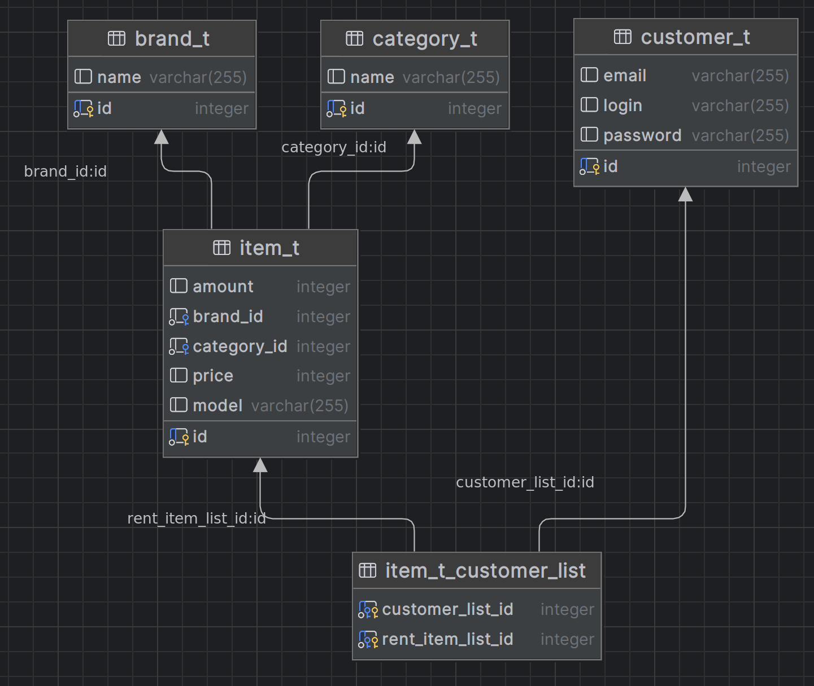

# Сервис аренды оборудования
***
### Описание
* Разработать сервис аренды оборудования, который позволит пользователям арендовать оборудование

##### <u>Основные функции</u>
* Регистрация пользователей;
* Управление оборудованием (добавление, удаление, изменение информации об оборудовании).
* Поиск и выбор оборудования для аренды;
* Аренда оборудования;
* Отслеживание срока аренды.

##### <u>Технические требования</u>

* Использование Java и Spring Framework для разработки;
* Поддержка баз данных PostgreSQL;
* Реализация REST API для взаимодействия с клиентами;
* Разработка веб-интерфейса для пользователей и администраторов;
***
### Используемые технологии для реализации данного сервиса
* Java — язык программирования для разработки;
* Spring Framework — фреймворк для создания веб-приложений на Java;
* PostgreSQL — реляционная база данных, для хранения данных о пользователях, оборудовании и аренде;
* REST API — для взаимодействия с клиентами и предоставления информации об оборудовании;
* Thymeleaf — шаблонизатор для Java;
* Тестирование — ?????
***
### Предметная область
Начальное состояние предметной области:

